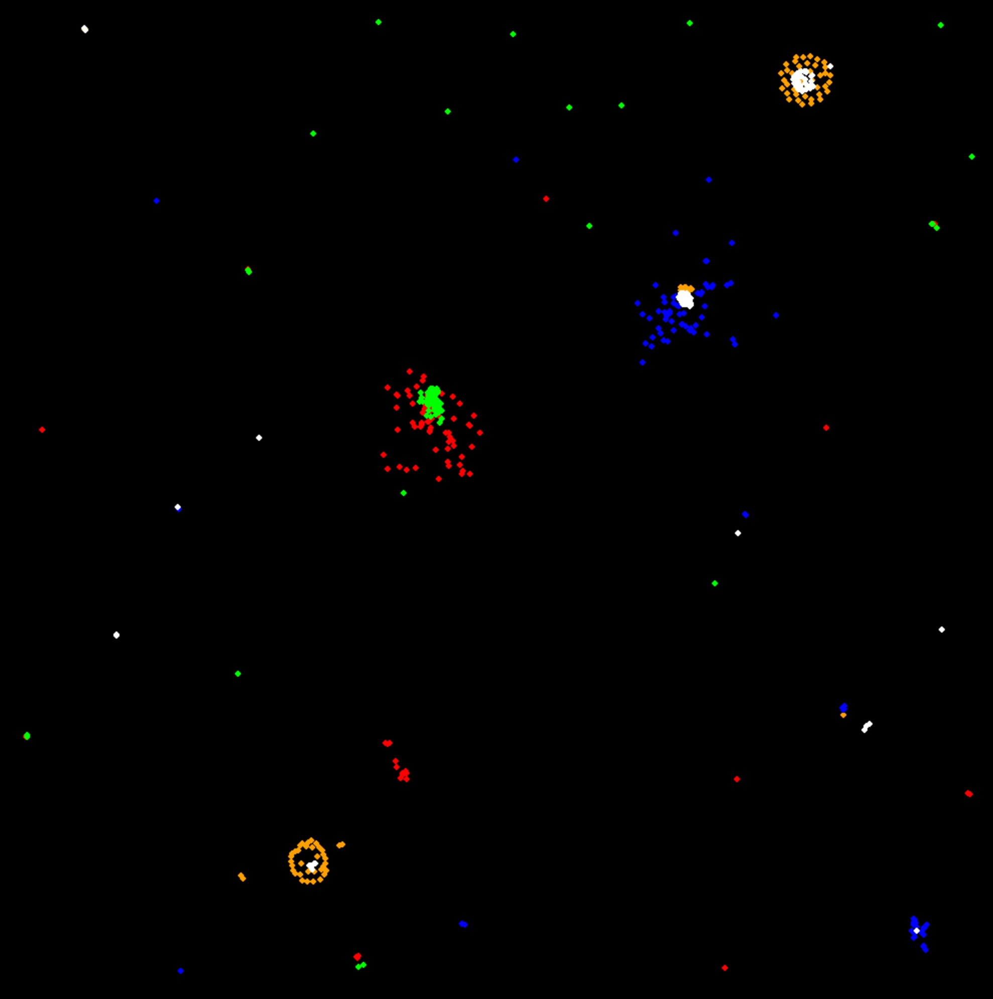

# Emergent Garden


## Contributing

Contributions are welcome! Feel free to open a pull request or submit an issue if you find any bugs or have any suggestions for new features.

## Introduction

Emergent behavior is a fascinating phenomenon that can be observed in a variety of complex systems. By simulating these systems, we can gain a better understanding of how they work and how emergent behavior arises. 

This project is a simulation of emergent behaviour, with particles that interact with each other and their environment. In this simulation, I start off with particles that move and bounce around at a constant speed. Then one after the other we start adding simple interaction rules. At the end we find that even with an extremely small set of rules, the emerging behaviour is seeming chaotic but oddly organised.

## Some example images





TODO: Better GIFs to be added here later.

https://user-images.githubusercontent.com/95016059/222963837-e8ee8f93-9801-4724-95ba-d5fdd2b2f799.mov

https://user-images.githubusercontent.com/95016059/222963862-7694d343-2658-421c-ae9e-ea5b7686f50f.mov

https://user-images.githubusercontent.com/95016059/223040045-1a34ad97-63f3-4325-9cc7-e44061713d26.mov

https://user-images.githubusercontent.com/95016059/223040070-bec16136-0791-455a-84ab-9abf429b69cb.mov

## Decisions
The following decisions were made during the implementation of the simulation:

- Particles spawn at random locations within the spawning margins, and move around the screen according to a variety of forces.
- Particles interact with each other, either repelling or attracting each other depending on their relative distance and force values.
- Particles also interact with the walls of the screen, either bouncing off of them or being attracted to them.
- The simulation can be adjusted with various parameters, including the number of particles, the frame rate, and the force values.
- The simulation was implemented in Python 3, as it is a popular and widely-used language that is easy to read and write.
- Pygame was chosen for visualisation, as it is a popular library for game development in Python and provides a simple interface for handling graphics and user input.
- The simulation was designed to be highly customisable, with a large number of adjustable parameters for both the particle system and the

## The rules/physics of the simulations

The simulation is written in Python, using the Pygame library for graphics. The particles are represented as circles on the screen, and their movement and interactions are determined by a series of simple physics calculations.

Each particle is assigned a force value, which determines how strongly it repels or attracts other particles. The force value is randomized at the start of the simulation within a defined range. The particles also lose a small amount of energy over time, causing them to eventually slow down and come to a stop.

The walls of the screen exert a heat force on the particles, which pulls them towards the centre of the screen. This force is also randomized at the start of the simulation. The walls themselves can be set to be either hard boundaries or elastic, causing particles to either bounce off of them or be attracted to them.

The simulation consists of several particles that move around a 2D environment. Each particle follows basic laws of physics: it moves with constant velocity unless acted on by an external force, and it experiences a force proportional to the inverse square of the distance to other particles. The particles are also affected by the boundaries of the simulation environment, which exert a repulsive force to keep them from leaving.

The particles are also affected by a global "heat" value, representing the system's overall energy. As the heat increases, particles move more rapidly and collide with each other more frequently. Conversely, as the heat decreases, particles slow down and collisions become less common. The user can adjust this heat value to control the behaviour of the system.

The particles are displayed as coloured circles on the screen, and the user can adjust their size and colour. Additionally, the user can adjust the number of particles in the system and their initial velocity.

Other details about the rules are skipped here.

## Installation and configuration

1. Clone the repository: `git clone https://github.com/vishalpaudel/emergent-garden.git`
2. Navigate to the project directory: `cd emergent-garden`
3. Create python environment: `python3.11 -m venv .venv --prompt="emergent-garden"`
4. Source the virtual environment: `source ./.venv/bin/activate`
5. Install the required dependencies: `python -m pip install -r requirements.txt`
6. Run main.py: `python main.py`
7. Change parameters in `./src/constants.py`

## Running the Simulation

To run the simulation, navigate to the directory containing the main.py code and run the following command:

```sh
python main.py
```

## Controls
There are several constants defined in the constants.py file that control various aspects of the simulation:

- PARTICLE_DEFAULT_SPAWN_NUM: The default number of particles to spawn when the simulation starts.
- SCREEN_DIM: The dimensions of the simulation screen.
- BACK_BLACK: The background color of the simulation screen.
- PARTICLE_DEFAULT_RADIUS: The default radius of particles.
- PARTICLE_COLOR_RED, PARTICLE_COLOR_YELLOW, PARTICLE_COLOR_GREEN, and PARTICLE_COLOR_BLUE: Predefined colors for particles.
- PARTICLE_DEFAULT_SPAWN_FRAME: The default spawning area for particles.

## Advanced Controls
For advanced users, the simulation includes a number of additional controls:

- WALL_HEAT: A value controlling the repulsive force between particles and the walls of the simulation environment. Increasing this value will cause particles to bounce more forcefully off the walls.
- WALL_BOUNDARY: A value controlling the distance between particles and the walls of the simulation environment. Increasing this value will cause particles to be more strongly repelled by the walls.
- FRAME_RATE: The number of frames per second that the simulation runs at.
- PARTICLE_LOSE_ENERGY: A value controlling the amount of energy particles lose on each collision. Increasing this value will cause the system to lose energy more quickly.
- PARTICLE_FORCE_LOWER_RANGE: The lower bound for the range of forces particles can exert on each other.
- PARTICLE_FORCE_UPPER_RANGE: The upper bound for the range of forces particles can exert on each other.
- PARTICLE_DEFAULT_UPDATE_TIME: The amount of time between particle updates.
- PARTICLE_POWER_OF_DISTANCE: A value controlling the strength of the inverse square law governing particle interactions.

## Future Work
The current implementation of the simulation provides a solid foundation for exploring emergent behaviour in complex systems. However, there is always room for improvement and expansion. Some potential areas for future work include:

- Integrating machine learning algorithms: As mentioned above, machine learning algorithms could be used to optimize emergent outcomes in the simulation. This could involve training agents to control particle behaviour or using reinforcement learning techniques to identify optimal parameters for the simulation.
- Adding more complex particle behaviours: Currently, particles simply move around and bounce off walls. Adding more complex behaviours, such as flocking or swarming, could lead to even more interesting emergent behaviour.
- Implementing different types of particles: The current implementation only includes one type of particle. Adding particles with different properties or behaviours could add even more complexity to the simulation.
- Improving performance: Depending on the number of particles in the simulation, performance can become an issue. Optimizing the simulation code and leveraging parallel processing techniques could help to improve performance and allow for larger simulations.

## Conclusion
This simulation provides a simple but powerful tool for exploring emergent behaviour in particle systems and can be expanded upon in a variety of ways to explore even more complex systems.

## Further explorations

BrainXYZ (YouTube)

## License

This project is licensed under the MIT License. See the `LICENSE` file for more information.

@vishalpaudel


